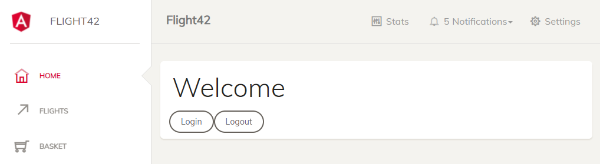

# Angular Architecture Workshop

This is the accompanying application for the workshop.

Install the dependencies by running ``npm ci``.

You should then be able to start the application via ``npm run start``. After some time, the following browser window should open:

